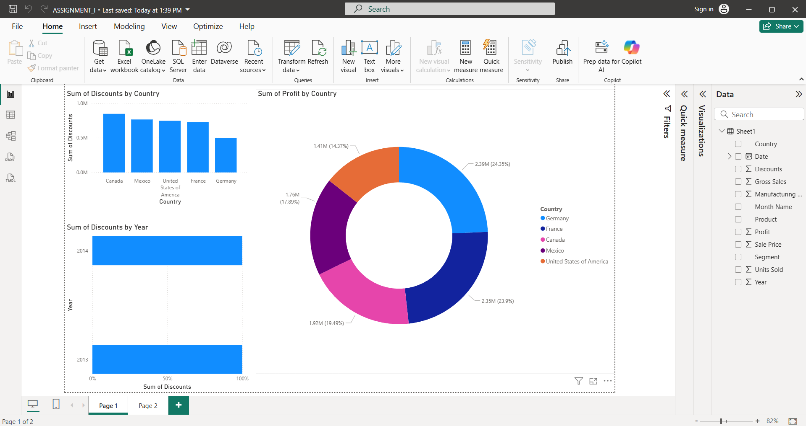

# DVSTL

# Introduction to Power BI

Power BI is a business analytics tool developed by Microsoft that enables users to visualize data, share insights, and transform raw information into actionable reports and dashboards. It supports a wide variety of data sources and provides interactive features for exploration and analysis.

## Installation  

1. Visit the official Power BI download page: [https://powerbi.microsoft.com/desktop](https://powerbi.microsoft.com/desktop)
2. Download and install *Power BI Desktop*
3. Launch Power BI and sign in using your Microsoft account

## Assignment Output

The screenshot below represents output from the Power BI assignment dashboard:

   

## Introduction to Data Visualization

Data visualization is the graphical representation of information and data. By using charts, graphs, and maps, data visualization tools help users understand patterns, trends, and outliers in data.

### Benefits of Data Visualization

* Simplifies complex datasets
* Enhances decision-making
* Highlights key insights at a glance
* Encourages data exploration and storytelling

## Introduction to Power BI and Its Features

### Key Features

* Drag-and-drop report building
* Real-time dashboard updates
* Interactive and customizable visuals
* Built-in and custom visual support
* Natural language query (Q\&A)
* Strong integration with Excel, SQL Server, Azure, and other data services
* Publishing and collaboration via Power BI Service

### Power BI Workflow

mermaid
graph TD
    A[Data Source] --> B[Power BI Desktop]
    B --> C[Transform Data with Power Query]
    C --> D[Data Model]
    D --> E[Create Visualizations]
    E --> F[Build Dashboard]
    F --> G[Publish to Power BI Service]

## Loading Data / Adding a Data Source in Power BI

To add data in Power BI:

1. Open *Power BI Desktop*
2. Click on *"Get Data"* from the Home ribbon
3. Select the desired data source (e.g., Excel, CSV, SQL Server)
4. Click *Connect* and load the data
5. Use *Power Query Editor* to transform, clean, or filter data before importing into your report

## Adding Graphs / Visualizations for Given Data

To create visualizations in Power BI:

1. Choose a visual type from the *Visualizations* pane
2. Drag and drop appropriate fields from the *Fields* pane
3. Configure visual elements:

   * X and Y axes (for charts)
   * Values and categories
   * Legends and tooltips
4. Use the *Format* pane to style the visual (labels, colors, titles)
5. Add *Slicers* or *Filters* to allow interactive report exploration

## Additional Tips

* Use *Bookmarks* for creating navigable reports
* Define *hierarchies* for drill-down capabilities
* Use *DAX formulas* for calculated fields and advanced metrics
* Apply *conditional formatting* to highlight trends and thresholds

## Resources

* Official Documentation: [https://docs.microsoft.com/en-us/power-bi/](https://docs.microsoft.com/en-us/power-bi/)
* YouTube Tutorials: Search "Power BI Full Course"
* DAX Reference: [https://dax.guide/](https://dax.guide/)
